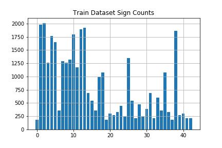
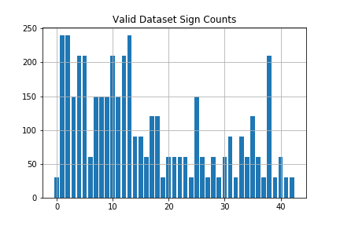
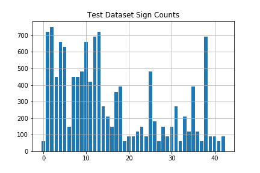
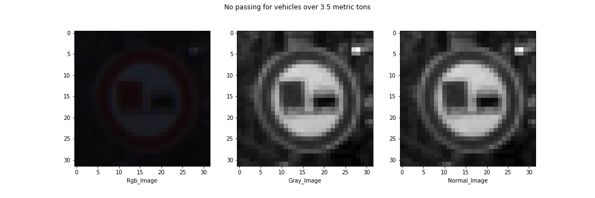

# **Traffic Sign Recognition**

### **Build a Traffic Sign Recognition Project**

The goals / steps of this project are the following:
* Load the data set (see below for links to the project data set)
* Explore, summarize and visualize the data set
* Design, train and test a model architecture
* Use the model to make predictions on new images
* Analyze the softmax probabilities of the new images
* Summarize the results with a written report  
_HIT:You can get the code though this link to my [code](https://github.com/udacity/CarND-Traffic-Sign-Classifier-Project/blob/master/Traffic_Sign_Classifier.ipynb)_
---


### Data Set Summary & Exploration

#### Provide a basic summary of the data set. In the code, the analysis should be done using python, numpy and/or pandas methods rather than hardcoding results manually.
* #### **Step 1: Load Data**  
```
# Load pickled data
import pickle

# TODO: Fill this in based on where you saved the training and testing data

training_file = './traffic-signs-data/train.p'
validation_file='./traffic-signs-data/valid.p'
testing_file = './traffic-signs-data/test.p'

with open(training_file, mode='rb') as f:
    train = pickle.load(f)
with open(validation_file, mode='rb') as f:
    valid = pickle.load(f)
with open(testing_file, mode='rb') as f:
    test = pickle.load(f)
    
X_train, y_train = train['features'], train['labels']
X_valid, y_valid = valid['features'], valid['labels']
X_test, y_test = test['features'], test['labels']
```
* #### **Step 2: Expore Data** 
I used the Numpy library to calculate summary statistics of the traffic
signs data set:

* The size of training set is **34799** `n_train = X_train.shape[0]`
* The size of the validation set is **4410** `n_validation = X_valid.shape[0]`
* The size of test set is **12630**
* The shape of a traffic sign image is **(32, 32, 3)** `image_shape = X_train.shape[1:]`
* The number of unique classes/labels in the data set is **43** `n_classes = len(set(y_train))`
```
# TODO: Number of training examples
n_train = X_train.shape[0]

# TODO: Number of validation examples
n_validation = X_valid.shape[0]

# TODO: Number of testing examples.
n_test = X_test.shape[0]

# TODO: What's the shape of an traffic sign image?
image_shape = X_train.shape[1:]

# TODO: How many unique classes/labels there are in the dataset.
n_classes = len(set(y_train))

print("Number of training examples =", n_train)
print("Number of testing examples =", n_test)
print("Image data shape =", image_shape)
print("Number of classes =", n_classes)
```
* #### **Step 3: Visualization of the dataset** 
Count the number of each category in the datasets of **Train** 、**Validation** and **Test**  
```
unique_train, counts_train = np.unique(y_train, return_counts=True)
plt.bar(unique_train, counts_train)
plt.grid()
plt.title("Train Dataset Sign Counts")
plt.savefig('./Train.png')
plt.show()

unique_test, counts_test = np.unique(y_test, return_counts=True)
plt.bar(unique_test, counts_test)
plt.grid()
plt.title("Test Dataset Sign Counts")
plt.savefig('./Test.png')
plt.show()

unique_valid, counts_valid = np.unique(y_valid, return_counts=True)
plt.bar(unique_valid, counts_valid)
plt.grid()
plt.title("Valid Dataset Sign Counts")
plt.savefig('./Valid.png')
plt.show()  
```
<table frame=void><tr>
<td></td>
<td></td>
<td></td>
</tr></table>

---

### Design and Test a Model Architecture

* #### **Step 1: Pre-processing Data**

&nbsp;&nbsp;&nbsp;**1. Convert RGB image to Gray image**
```  
def rgb2gray(rgb):
    return np.dot(rgb[...,:3], np.array([0.299, 0.587, 0.114]).reshape([3,1]))
def rgb2gray_mean(rgb):
    return np.sum(rgb/3, axis=3, keepdims=True)

X_train_rgb = X_train
X_train_gry = rgb2gray_mean(X_train_rgb)

X_valid_rgb = X_valid
X_valid_gry = rgb2gray_mean(X_valid_rgb)

X_test_rgb = X_test
X_test_gry = rgb2gray_mean(X_test_rgb)  
```
There are two methods you can use.
`rgb2gray(rgb)`: Gray=R\*0.299+G\*0.587+B\*0.114
`rgb2gray_mean(rgb)`: Gray=（R+G+B）/3; 

&nbsp;&nbsp;&nbsp;**2. Normalized processing**
```  
X_train_normalized = (X_train_gry - 128)/128 
X_valid_normalized = (X_valid_gry - 128)/128 
X_test_normalized = (X_test_gry - 128)/128
```

* ### Question

&nbsp;&nbsp;&nbsp;**What techniques were chosen and why did you choose these techniques?**
  
&nbsp;&nbsp;&nbsp;**Answer:**  
&nbsp;&nbsp;&nbsp;My dataset preprocessing consisted of:

* 1.**Converting to grayscale** : This worked well for Sermanet and LeCun as described in their traffic sign classification article. It also helps to reduce training time, since Gray image has only one channel compared to Rgb image.

* 2.**Normalizing the data to the range (-1,1)** : Normalization is a technique for deep learning. It can make the cost function more symmetrical, which can speed up the training process.

</td>

* #### **Step 2: Design a Model Architecture**

&nbsp;&nbsp;&nbsp;My final model consisted of the following layers:

| Layer         		|     Description	        					| 
|:---------------------:|:---------------------------------------------:| 
| Input         		| 32x32x1 Gray image   							| 
| Convolution 5x5     	| 1x1 stride, valid padding, outputs 28x28x6 	|
| RELU					|												|
| Max pooling	      	| 2x2 stride, valid padding, outputs 14x14x6 	|
| Convolution 5x5	    | 1x1 stride, valid padding, outputs 10x10x16   |  
| RELU                  |  
| Max pooling	      	| 2x2 stride, valid padding, outputs 5x5x16 	|
| Convolution 5x5     	| 1x1 stride, valid padding, outputs 1x1x400 	|
| RELU					|												|
|Flatten layers         | (1x1x400 -> 400)add(5x5x16 -> 400) outputs 800|
| Dropout               |             0.5                               |
| Fully connected		| etc.        									|
| Softmax				| etc.        									|
| Dropout               |             0.5                               |
| Fully connected		|           									|
| Softmax				| etc.        									|
| Dropout				|		      0.5							    |


* #### **Step 3: Train the Model**

```
import tensorflow as tf
from tensorflow.contrib.layers import flatten
from sklearn.utils import shuffle

EPOCH = 20
BATCH_SIZE = 128
LEARNING_RAT = 0.002
KEEP_PROB = 0.5

tf.reset_default_graph() 

x = tf.placeholder(tf.float32, (None, 32, 32, 1))
y = tf.placeholder(tf.int32, (None))
keep_prob = tf.placeholder(tf.float32) 
one_hot_y = tf.one_hot(y, 43)

logits = LeNet2(x)
cross_entropy = tf.nn.softmax_cross_entropy_with_logits(labels=one_hot_y, logits=logits)
loss_operation = tf.reduce_mean(cross_entropy)
optimizer = tf.train.AdamOptimizer(LEARNING_RAT).minimize(loss_operation)


#Accuracy
correct_prediction = tf.equal(tf.argmax(logits, 1), tf.argmax(one_hot_y, 1))
accuracy_operation = tf.reduce_mean(tf.cast(correct_prediction, tf.float32))
saver = tf.train.Saver()

def evaluate(X_data, y_data):
    num_examples = len(X_data)
    total_accuracy = 0
    sess = tf.get_default_session()
    for offset in range(0, num_examples, BATCH_SIZE):
        batch_x, batch_y = X_data[offset:offset+BATCH_SIZE], y_data[offset:offset+BATCH_SIZE]
        accuracy = sess.run(accuracy_operation, feed_dict={x: batch_x, y: batch_y,keep_prob:1.0})
        total_accuracy += (accuracy * len(batch_x))
    return total_accuracy / num_examples
    

with tf.Session() as sess:
    sess.run(tf.global_variables_initializer())
    num_examples = len(X_train)
    
    print("Training...")
    print()
    for i in range(EPOCH):
        X_train, y_train = shuffle(X_train, y_train)
        for offset in range(0, num_examples, BATCH_SIZE):
            end = offset + BATCH_SIZE
            batch_x, batch_y = X_train[offset:end], y_train[offset:end]
            sess.run(optimizer, feed_dict={x: batch_x, y: batch_y,keep_prob:0.5})
        
        train_accuracy = evaluate(X_train, y_train)
        validation_accuracy = evaluate(X_valid, y_valid)
        print("EPOCH {} ...".format(i+1))
        print("Train Accuracy = {:.3f}     Validation Accuracy = {:.3f}".format(train_accuracy,validation_accuracy))
        print()
    test_accuracy = evaluate(X_test, y_test)
    print("Test Accuracy = {:.3f}".format(test_accuracy))
    saver.save(sess, './lenet')

    print("Model saved")
```

#### 3. Describe how you trained your model. The discussion can include the type of optimizer, the batch size, number of epochs and any hyperparameters such as learning rate.

To train the model, I used an ....

#### 4. Describe the approach taken for finding a solution and getting the validation set accuracy to be at least 0.93. Include in the discussion the results on the training, validation and test sets and where in the code these were calculated. Your approach may have been an iterative process, in which case, outline the steps you took to get to the final solution and why you chose those steps. Perhaps your solution involved an already well known implementation or architecture. In this case, discuss why you think the architecture is suitable for the current problem.

My final model results were:
* training set accuracy of ?
* validation set accuracy of ? 
* test set accuracy of ?

If an iterative approach was chosen:
* What was the first architecture that was tried and why was it chosen?
* What were some problems with the initial architecture?
* How was the architecture adjusted and why was it adjusted? Typical adjustments could include choosing a different model architecture, adding or taking away layers (pooling, dropout, convolution, etc), using an activation function or changing the activation function. One common justification for adjusting an architecture would be due to overfitting or underfitting. A high accuracy on the training set but low accuracy on the validation set indicates over fitting; a low accuracy on both sets indicates under fitting.
* Which parameters were tuned? How were they adjusted and why?
* What are some of the important design choices and why were they chosen? For example, why might a convolution layer work well with this problem? How might a dropout layer help with creating a successful model?

If a well known architecture was chosen:
* What architecture was chosen?
* Why did you believe it would be relevant to the traffic sign application?
* How does the final model's accuracy on the training, validation and test set provide evidence that the model is working well?
 

### Test a Model on New Images

#### 1. Choose five German traffic signs found on the web and provide them in the report. For each image, discuss what quality or qualities might be difficult to classify.

Here are five German traffic signs that I found on the web:

![alt text][image4] ![alt text][image5] ![alt text][image6] 
![alt text][image7] ![alt text][image8]

The first image might be difficult to classify because ...

#### 2. Discuss the model's predictions on these new traffic signs and compare the results to predicting on the test set. At a minimum, discuss what the predictions were, the accuracy on these new predictions, and compare the accuracy to the accuracy on the test set (OPTIONAL: Discuss the results in more detail as described in the "Stand Out Suggestions" part of the rubric).

Here are the results of the prediction:

| Image			        |     Prediction	        					| 
|:---------------------:|:---------------------------------------------:| 
| Stop Sign      		| Stop sign   									| 
| U-turn     			| U-turn 										|
| Yield					| Yield											|
| 100 km/h	      		| Bumpy Road					 				|
| Slippery Road			| Slippery Road      							|


The model was able to correctly guess 4 of the 5 traffic signs, which gives an accuracy of 80%. This compares favorably to the accuracy on the test set of ...

#### 3. Describe how certain the model is when predicting on each of the five new images by looking at the softmax probabilities for each prediction. Provide the top 5 softmax probabilities for each image along with the sign type of each probability. (OPTIONAL: as described in the "Stand Out Suggestions" part of the rubric, visualizations can also be provided such as bar charts)

The code for making predictions on my final model is located in the 11th cell of the Ipython notebook.

For the first image, the model is relatively sure that this is a stop sign (probability of 0.6), and the image does contain a stop sign. The top five soft max probabilities were

| Probability         	|     Prediction	        					| 
|:---------------------:|:---------------------------------------------:| 
| .60         			| Stop sign   									| 
| .20     				| U-turn 										|
| .05					| Yield											|
| .04	      			| Bumpy Road					 				|
| .01				    | Slippery Road      							|


For the second image ... 

### (Optional) Visualizing the Neural Network (See Step 4 of the Ipython notebook for more details)
#### 1. Discuss the visual output of your trained network's feature maps. What characteristics did the neural network use to make classifications?


