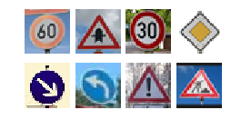

# **Traffic Sign Recognition**

### **Build a Traffic Sign Recognition Project**

The goals / steps of this project are the following:
* Load the data set (see below for links to the project data set)
* Explore, summarize and visualize the data set
* Design, train and test a model architecture
* Use the model to make predictions on new images
* Analyze the softmax probabilities of the new images
* Summarize the results with a written report  
_HIT:You can get the code though this link to my [code](https://github.com/udacity/CarND-Traffic-Sign-Classifier-Project/blob/master/Traffic_Sign_Classifier.ipynb)_
---


### Data Set Summary & Exploration

#### Provide a basic summary of the data set. In the code, the analysis should be done using python, numpy and/or pandas methods rather than hardcoding results manually.
* #### **Step 1: Load Data**  
```
# Load pickled data
import pickle

# TODO: Fill this in based on where you saved the training and testing data

training_file = './traffic-signs-data/train.p'
validation_file='./traffic-signs-data/valid.p'
testing_file = './traffic-signs-data/test.p'

with open(training_file, mode='rb') as f:
    train = pickle.load(f)
with open(validation_file, mode='rb') as f:
    valid = pickle.load(f)
with open(testing_file, mode='rb') as f:
    test = pickle.load(f)
    
X_train, y_train = train['features'], train['labels']
X_valid, y_valid = valid['features'], valid['labels']
X_test, y_test = test['features'], test['labels']
```
* #### **Step 2: Expore Data** 
I used the Numpy library to calculate summary statistics of the traffic
signs data set:

* The size of training set is **34799** `n_train = X_train.shape[0]`
* The size of the validation set is **4410** `n_validation = X_valid.shape[0]`
* The size of test set is **12630** `n_test = X_test.shape[0]`
* The shape of a traffic sign image is **(32, 32, 3)** `image_shape = X_train.shape[1:]`
* The number of unique classes/labels in the data set is **43** `n_classes = len(set(y_train))`
```
# TODO: Number of training examples
n_train = X_train.shape[0]

# TODO: Number of validation examples
n_validation = X_valid.shape[0]

# TODO: Number of testing examples.
n_test = X_test.shape[0]

# TODO: What's the shape of an traffic sign image?
image_shape = X_train.shape[1:]

# TODO: How many unique classes/labels there are in the dataset.
n_classes = len(set(y_train))

print("Number of training examples =", n_train)
print("Number of testing examples =", n_test)
print("Image data shape =", image_shape)
print("Number of classes =", n_classes)
```
* #### **Step 3: Visualization of the dataset** 
Count the number of each category in the datasets of **Train** 、**Validation** and **Test**  
```
unique_train, counts_train = np.unique(y_train, return_counts=True)
plt.bar(unique_train, counts_train)
plt.grid()
plt.title("Train Dataset Sign Counts")
plt.savefig('./Train.png')
plt.show()

unique_test, counts_test = np.unique(y_test, return_counts=True)
plt.bar(unique_test, counts_test)
plt.grid()
plt.title("Test Dataset Sign Counts")
plt.savefig('./Test.png')
plt.show()

unique_valid, counts_valid = np.unique(y_valid, return_counts=True)
plt.bar(unique_valid, counts_valid)
plt.grid()
plt.title("Valid Dataset Sign Counts")
plt.savefig('./Valid.png')
plt.show()  
```
<table frame=void><tr>
<td></td>
<td></td>
<td></td>
</tr></table>

---

### Design and Test a Model Architecture

* #### **Step 1: Pre-processing Data**

&nbsp;&nbsp;&nbsp;**1. Convert RGB image to Gray image**
```  
def rgb2gray(rgb):
    return np.dot(rgb[...,:3], np.array([0.299, 0.587, 0.114]).reshape([3,1]))
def rgb2gray_mean(rgb):
    return np.sum(rgb/3, axis=3, keepdims=True)

X_train_rgb = X_train
X_train_gry = rgb2gray_mean(X_train_rgb)

X_valid_rgb = X_valid
X_valid_gry = rgb2gray_mean(X_valid_rgb)

X_test_rgb = X_test
X_test_gry = rgb2gray_mean(X_test_rgb)  
```
There are two methods you can use.
`rgb2gray(rgb)`: Gray=R\*0.299+G\*0.587+B\*0.114
`rgb2gray_mean(rgb)`: Gray=（R+G+B）/3; 

&nbsp;&nbsp;&nbsp;**2. Normalized processing**
```  
X_train_normalized = (X_train_gry - 128)/128 
X_valid_normalized = (X_valid_gry - 128)/128 
X_test_normalized = (X_test_gry - 128)/128
```

* ### Question

&nbsp;&nbsp;&nbsp;**What techniques were chosen and why did you choose these techniques?**
  
&nbsp;&nbsp;&nbsp;**Answer:**  
&nbsp;&nbsp;&nbsp;My dataset preprocessing consisted of:

* 1.**Converting to grayscale** : This worked well for Sermanet and LeCun as described in their traffic sign classification article. It also helps to reduce training time, since Gray image has only one channel compared to Rgb image.

* 2.**Normalizing the data to the range (-1,1)** : Normalization is a technique for deep learning. It can make the cost function more symmetrical, which can speed up the training process.

</td>

* #### **Step 2: Design a Model Architecture**

&nbsp;&nbsp;&nbsp;My final model consisted of the following layers:

| Layer         		|     Description	        					| 
|:---------------------:|:---------------------------------------------:| 
| Input         		| 32x32x1 Gray image   							| 
| Convolution 5x5     	| 1x1 stride, valid padding, outputs 28x28x6 	|
| RELU					|												|
| Max pooling	      	| 2x2 stride, valid padding, outputs 14x14x6 	|
| Convolution 5x5	    | 1x1 stride, valid padding, outputs 10x10x16   |  
| RELU                  |  
| Max pooling	      	| 2x2 stride, valid padding, outputs 5x5x16 	|
| Convolution 5x5     	| 1x1 stride, valid padding, outputs 1x1x400 	|
| RELU					|												|
|Flatten layers         | (1x1x400 -> 400)add(5x5x16 -> 400) outputs 800|
| Dropout               |             0.5                               |
| Fully connected		|Inputs 800  &nbsp;&nbsp;&nbsp;outputs 256   	|
| RELU  				|         									    |
| Dropout               |             0.5                               |
| Fully connected		|Inputs 256  &nbsp;&nbsp;&nbsp;outputs 128      |
| RELU  				|           									|
| Dropout				|		      0.5							    |
| Fully connected		|Inputs 128  &nbsp;&nbsp;&nbsp;outputs 43   	|
| Softmax  				|         									    |

#### **Modified LeNet Model Architecture**
adapted from Sermanet/LeCunn traffic sign classification journal article, but in order to learn more feature, I add two full-connect layer in the last layer.


```
from tensorflow.contrib.layers import flatten

def LeNet2(x):    
    # Hyperparameters
    mu = 0
    sigma = 0.1
    
    # TODO: Layer 1: Convolutional. Input = 32x32x1. Output = 28x28x6.
    W1 = tf.Variable(tf.truncated_normal(shape=(5, 5, 1, 6), mean = mu, stddev = sigma), name="W1")
    x = tf.nn.conv2d(x, W1, strides=[1, 1, 1, 1], padding='VALID')
    b1 = tf.Variable(tf.zeros(6), name="b1")
    x = tf.nn.bias_add(x, b1)
    print("layer 1 shape:",x.get_shape())

    # TODO: Activation.
    x = tf.nn.relu(x)
    
    # TODO: Pooling. Input = 28x28x6. Output = 14x14x6.
    x = tf.nn.max_pool(x, ksize=[1, 2, 2, 1], strides=[1, 2, 2, 1], padding='VALID')
    layer1 = x
    
    # TODO: Layer 2: Convolutional. Output = 10x10x16.
    W2 = tf.Variable(tf.truncated_normal(shape=(5, 5, 6, 16), mean = mu, stddev = sigma), name="W2")
    x = tf.nn.conv2d(x, W2, strides=[1, 1, 1, 1], padding='VALID')
    b2 = tf.Variable(tf.zeros(16), name="b2")
    x = tf.nn.bias_add(x, b2)
                     
    # TODO: Activation.
    x = tf.nn.relu(x)

    # TODO: Pooling. Input = 10x10x16. Output = 5x5x16.
    x = tf.nn.max_pool(x, ksize=[1, 2, 2, 1], strides=[1, 2, 2, 1], padding='VALID')
    layer2 = x
    
    # TODO: Layer 3: Convolutional. Output = 1x1x400.
    W3 = tf.Variable(tf.truncated_normal(shape=(5, 5, 16, 400), mean = mu, stddev = sigma), name="W3")
    x = tf.nn.conv2d(x, W3, strides=[1, 1, 1, 1], padding='VALID')
    b3 = tf.Variable(tf.zeros(400), name="b3")
    x = tf.nn.bias_add(x, b3)
                     
    # TODO: Activation.
    x = tf.nn.relu(x)
    layer3 = x

    # TODO: Flatten. Input = 5x5x16. Output = 400.
    layer2flat = flatten(layer2)
    print("layer2flat shape:",layer2flat.get_shape())
    
    # Flatten x. Input = 1x1x400. Output = 400.
    xflat = flatten(x)
    print("xflat shape:",xflat.get_shape())
    
    # Concat layer2flat and x. Input = 400 + 400. Output = 800
    x = tf.concat([xflat, layer2flat], 1)
    print("x shape:",x.get_shape())
    
    # Dropout
    x = tf.nn.dropout(x, keep_prob)
    
    # TODO: Layer 4: Fully Connected. Input = 800. Output = 256.
    W4 = tf.Variable(tf.truncated_normal(shape=(800, 256), mean = mu, stddev = sigma), name="W4")
    b4 = tf.Variable(tf.zeros(256), name="b4")
    Layer_4 = tf.add(tf.matmul(x, W4), b4)
    Layer_4 = tf.nn.relu(Layer_4)
    Layer_4 = tf.nn.dropout(Layer_4, keep_prob)
    
    W5 = tf.Variable(tf.truncated_normal(shape=(256, 128), mean = mu, stddev = sigma), name='W5')
    b5 = tf.Variable(tf.zeros(128), name='b5')
    Layer_5 = tf.matmul(Layer_4, W5) + b5
    Layer_5 = tf.nn.relu(Layer_5)
    Layer_5 = tf.nn.dropout(Layer_5, keep_prob)
    
    W6 = tf.Variable(tf.truncated_normal(shape=(128, 43), mean = mu, stddev = sigma), name = 'W6')
    b6 = tf.Variable(tf.zeros(43), name = 'b6')
    logits = tf.matmul(Layer_5, W6) + b6
        
    return logits
```

* #### **Step 3: Train the Model**

```
import tensorflow as tf
from tensorflow.contrib.layers import flatten
from sklearn.utils import shuffle

EPOCH = 20
BATCH_SIZE = 128
LEARNING_RAT = 0.002
KEEP_PROB = 0.5

tf.reset_default_graph() 

x = tf.placeholder(tf.float32, (None, 32, 32, 1))
y = tf.placeholder(tf.int32, (None))
keep_prob = tf.placeholder(tf.float32) 
one_hot_y = tf.one_hot(y, 43)

logits = LeNet2(x)
cross_entropy = tf.nn.softmax_cross_entropy_with_logits(labels=one_hot_y, logits=logits)
loss_operation = tf.reduce_mean(cross_entropy)
optimizer = tf.train.AdamOptimizer(LEARNING_RAT).minimize(loss_operation)


#Accuracy
correct_prediction = tf.equal(tf.argmax(logits, 1), tf.argmax(one_hot_y, 1))
accuracy_operation = tf.reduce_mean(tf.cast(correct_prediction, tf.float32))
saver = tf.train.Saver()

def evaluate(X_data, y_data):
    num_examples = len(X_data)
    total_accuracy = 0
    sess = tf.get_default_session()
    for offset in range(0, num_examples, BATCH_SIZE):
        batch_x, batch_y = X_data[offset:offset+BATCH_SIZE], y_data[offset:offset+BATCH_SIZE]
        accuracy = sess.run(accuracy_operation, feed_dict={x: batch_x, y: batch_y,keep_prob:1.0})
        total_accuracy += (accuracy * len(batch_x))
    return total_accuracy / num_examples
    

with tf.Session() as sess:
    sess.run(tf.global_variables_initializer())
    num_examples = len(X_train)
    
    print("Training...")
    print()
    for i in range(EPOCH):
        X_train, y_train = shuffle(X_train, y_train)
        for offset in range(0, num_examples, BATCH_SIZE):
            end = offset + BATCH_SIZE
            batch_x, batch_y = X_train[offset:end], y_train[offset:end]
            sess.run(optimizer, feed_dict={x: batch_x, y: batch_y,keep_prob:0.5})
        
        train_accuracy = evaluate(X_train, y_train)
        validation_accuracy = evaluate(X_valid, y_valid)
        print("EPOCH {} ...".format(i+1))
        print("Train Accuracy = {:.3f}     Validation Accuracy = {:.3f}".format(train_accuracy,validation_accuracy))
        print()
    test_accuracy = evaluate(X_test, y_test)
    print("Test Accuracy = {:.3f}".format(test_accuracy))
    saver.save(sess, './lenet')

    print("Model saved")
```

&nbsp;&nbsp;&nbsp;My final model results were:
* training set accuracy of **0.998**
* validation set accuracy of **0.968** 
* test set accuracy of **0.940**

* ### Question

* What architecture was chosen?

&nbsp;&nbsp;&nbsp;First step, I choose modifiy Lenet which come from Sermanet/LeCunn traffic sign classification journal article, but the model architecture has one Fully connected layer, reduce 800 features to 43 features that means a lot of information will be lost. So, I add two full-connect layer in the last layer to learn more features.
* Why did you believe it would be relevant to the traffic sign application?

&nbsp;&nbsp;&nbsp;I just guessed the test, firstly, but the result proved very good

* How does the final model's accuracy on the training, validation and test set provide evidence that the model is working well?
 

* #### **Step 4: Test a Model on New Images**

#### 1. Choose eight German traffic signs found on the web and provide them in the report. For each image, discuss what quality or qualities might be difficult to classify.

Here are eight German traffic signs that I found on the web:

    

#### 2. Discuss the model's predictions on these new traffic signs.

```
my_labels = [3, 11, 1, 12, 38, 34, 18, 25]
try:
    del my_accuracy
except:
    pass
with tf.Session() as sess:
    sess.run(tf.global_variables_initializer())
    saver3 = tf.train.import_meta_graph('./lenet.meta')
    saver3.restore(sess, "./lenet")
    my_accuracy = evaluate(my_images_normalized, my_labels)
    print("Test Set Accuracy = {:.3f}".format(my_accuracy))
```
```
Test Set Accuracy = 1.000
```

Here are the results of the prediction:

| Image			        |     Prediction	        					| 
|:---------------------:|:---------------------------------------------:| 
| Speed limit (60km/h)  | Speed limit (60km/h)   						| 
| Right-of-way at the next intersection| Right-of-way at the next intersection |
| Speed limit (30km/h)	| Speed limit (30km/h)							|
| Priority road	      	| Priority road					 				|
| Keep right			| Keep right      							    |
| Turn left ahead		| Turn left ahead      							|
| General caution		| General caution      							|
| Road work			    | Road work      							    |
| Keep right			| Keep right      							    |

#### 3. Describe how certain the model is when predicting on each of the eight new images by looking at the softmax probabilities for each prediction. Provide the top 5 softmax probabilities for each image along with the sign type of each probability.

```
my_labels_tensor = [3, 11, 1, 12, 38, 34, 18, 25]
#my_labels_onehot = tf.one_hot(my_labels, 43)
#logits = LeNet2(x)

top5_prediction = tf.nn.in_top_k(logits, my_labels_tensor, k=5)
top5_accuracy = tf.reduce_mean(tf.cast(top5_prediction, tf.float32))

with tf.Session() as sess:
    sess.run(tf.global_variables_initializer())
    saver4 = tf.train.import_meta_graph('./lenet.meta')
    saver4.restore(sess, "./lenet")
    result = sess.run(logits, feed_dict={x:my_images_normalized,keep_prob:1.})
    values,indices = sess.run(tf.nn.top_k(result,k=5))
    print('='*40)
    print("TOP-5 result: {}".format(values))
    print("Label index: {}".format(indices))
    print('='*40)
    top5_acc = sess.run(top5_accuracy,feed_dict={x:my_images_normalized,keep_prob:1.})
    print('TOP-5 accuracy: {}'.format(top5_acc))
    
for i, my_label in enumerate(my_labels_tensor):
    print("="*40)
    print("{} picture real label is:{}".format(i+1, classes[my_label]))
    print('*'*20)
    print("Prediction result:")
    for predict_label, prob_value in zip(indices[i],values[i]):
        print('{:<50s} probability is {:5.2f}'.format(classes[predict_label], prob_value))
    print()
```

```
========================================
1 picture real label is:Speed limit (60km/h)
********************
Prediction result:
Speed limit (60km/h)                               probability is 23.09
Speed limit (80km/h)                               probability is  4.59
Slippery road                                      probability is  4.41
Speed limit (50km/h)                               probability is -2.35
No passing for vehicles over 3.5 metric tons       probability is -6.60

========================================
2 picture real label is:Right-of-way at the next intersection
********************
Prediction result:
Right-of-way at the next intersection              probability is 82.73
Beware of ice/snow                                 probability is 27.87
Pedestrians                                        probability is  4.07
Double curve                                       probability is  0.85
End of no passing by vehicles over 3.5 metric tons probability is -6.73

========================================
3 picture real label is:Speed limit (30km/h)
********************
Prediction result:
Speed limit (30km/h)                               probability is 19.23
Speed limit (70km/h)                               probability is  9.30
Speed limit (20km/h)                               probability is  9.12
Roundabout mandatory                               probability is  1.02
Speed limit (50km/h)                               probability is  0.85

========================================
4 picture real label is:Priority road
********************
Prediction result:
Priority road                                      probability is 93.20
Roundabout mandatory                               probability is 31.26
End of no passing                                  probability is -8.36
No passing                                         probability is -10.91
No passing for vehicles over 3.5 metric tons       probability is -11.68

========================================
5 picture real label is:Keep right
********************
Prediction result:
Keep right                                         probability is 251.72
Turn left ahead                                    probability is 26.17
Speed limit (60km/h)                               probability is -11.36
Priority road                                      probability is -24.34
Dangerous curve to the right                       probability is -31.26

========================================
6 picture real label is:Turn left ahead
********************
Prediction result:
Turn left ahead                                    probability is 51.85
Speed limit (60km/h)                               probability is  5.72
End of all speed and passing limits                probability is  4.85
Stop                                               probability is -1.91
Ahead only                                         probability is -2.60

========================================
7 picture real label is:General caution
********************
Prediction result:
General caution                                    probability is 83.48
Traffic signals                                    probability is 26.67
Pedestrians                                        probability is 25.89
Right-of-way at the next intersection              probability is  1.75
Turn right ahead                                   probability is -7.38

========================================
8 picture real label is:Road work
********************
Prediction result:
Road work                                          probability is 15.41
Traffic signals                                    probability is  5.83
Wild animals crossing                              probability is  2.67
Road narrows on the right                          probability is  2.53
Bicycles crossing                                  probability is  1.28
```

